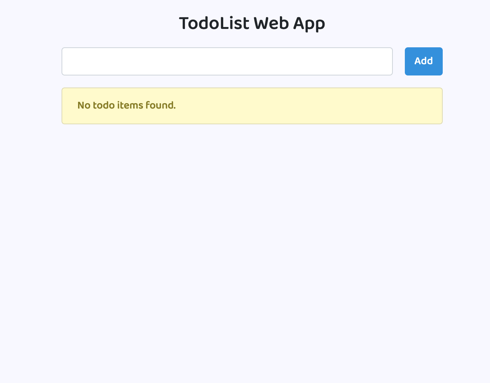
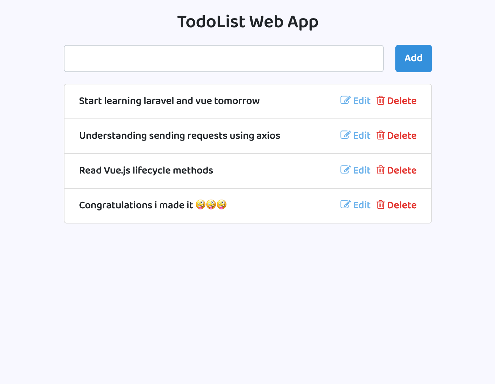
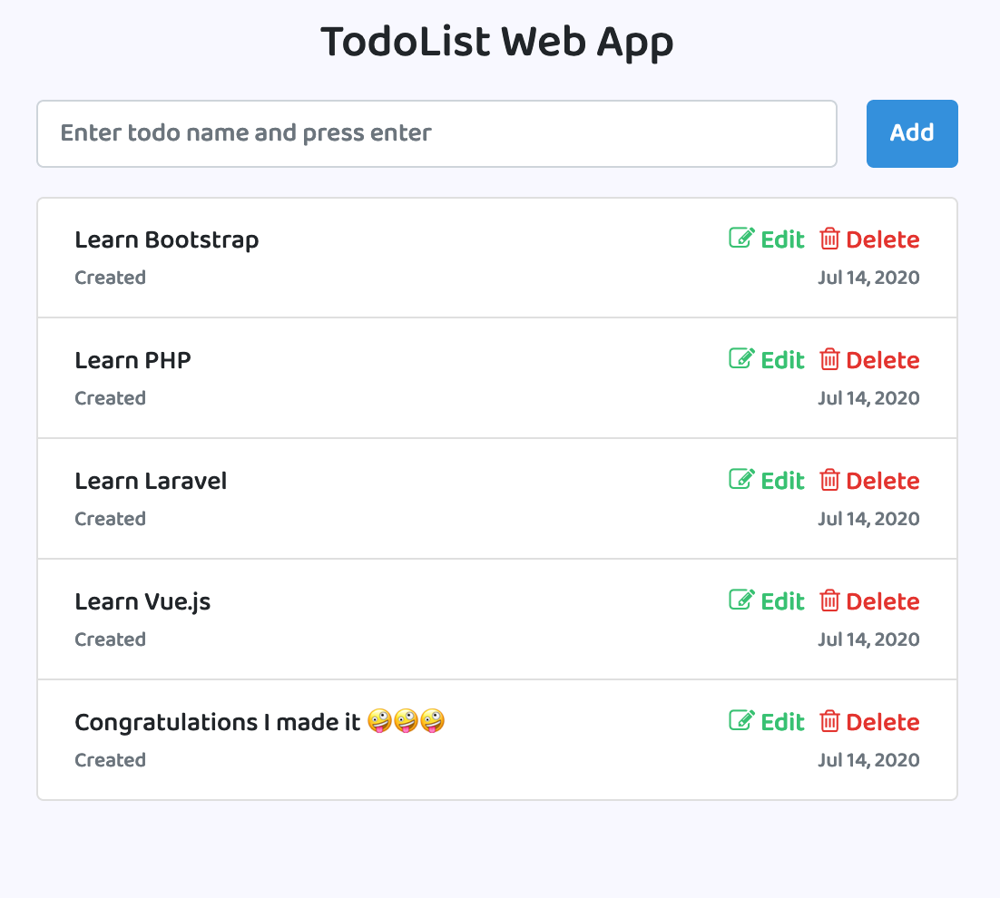

# Laravel Vue.js TodoList Web Application

This is a Web Application leveraging on Vue.js and Laravel to create SPA(Single Page Application) application.

The following must be installed and available on your terminal:
- [x] [composer](https://getcomposer.org/doc/00-intro.md)
- [x] [npm](https://nodejs.org/en/)

### Screenshots
Empty List | With Items
------------ | -------------
 | 
 Edit Modal | Full list
|  | |


### INSTALLATION GUIDE
1. Clone the project
`git clone https://github.com/mulugu/laravel-vuejs-todolist.git`
1. ``cd`` to the project and run ``composer install`` on the terminal to install php dependencies
1. copy the `.env-example` file to `.env` file 
1. Create a Mysql database and edit the ``.env`` to reflect your connections as follows:
    ```dotenv
    DB_CONNECTION=mysql
    DB_HOST=127.0.0.1
    DB_PORT=3306
    DB_DATABASE=dbname
    DB_USERNAME=myuser
    DB_PASSWORD=mypass
    ```
1. Migrate your migrations: `php artisan migrate`
1. Generate application encryption key: `php artisan key:generate`
1. Run `npm install && npm run dev` to install node.js dependencies
1. Start your development server and start testing the web app. `php artisan serve --port 8080`
1. Congratulations if you made it!

Need helps? Reach me out 
>Email: kevinmulugu@gmail.com
>
>Twitter: [@kevvoh_](https://twitter.com/kevvoh_)
>
>Linkedin: [Kevin Mulugu](https://www.linkedin.com/in/kevinmulugu/)

All the best :beer:
